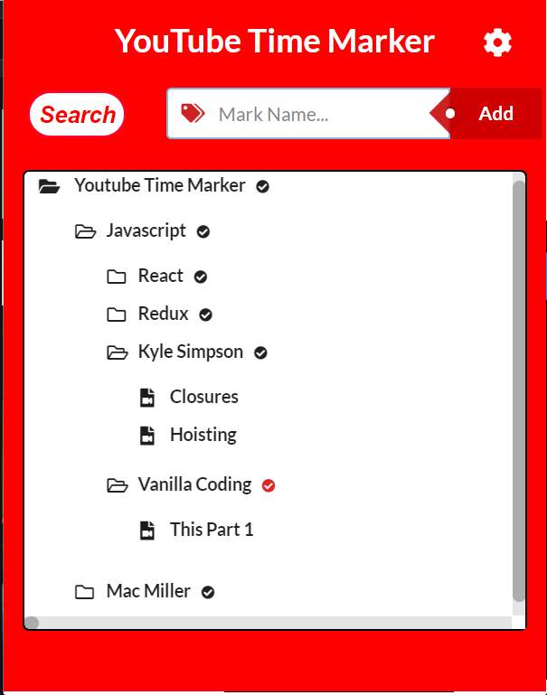

# YouTube Time Marker

# Introduction

**YouTube Time Marker**는 시청하던 동영상의 특정부분을 **Marking**하여 저장하는 **Chrome Extension**입니다. 

[]

## Requirements

- YouTube Time Marker은 Chrome Extension입니다.
- [Chrome Webstore](https://chrome.google.com/webstore/category/extensions?hl=ko)에서 설치가 선행되어야 합니다.


## Prerequisites

- React
- Semantic UI 

## Installation

### Client
```
git clone https://github.com/Dailyscat/Youtube-Time-Marker.git
cd Youtube-Time-Marker
npm install
npm start
```


## Features
- 시청하던 **YouTube Video**의 시간을 이름과 함께 저장 
- 폴더를 이용하여 분류가능
- 파일과 폴더의 **CRUD**(Create, Read, Update, Delete) 가능
- **Chrome Local Storage**를 데이터를 저장 
- **New Tab** Or **Current Tab** **Setting**가능
- **Tree View**를 이용하여 직관적인 데이터 관리 가능
- **Search** 버튼 클릭으로 데이터 검색 가능 
- **Marking**한 파일의 **Url** **Clip Board**에 복사 가능  
- 추가한 **File**이 시야에 없을 때 자동으로 **Scrolling**
- **Drag And Drop**을 활용한 **Custom Sort**
- **Marking**한 **File**의 **URL**복사 가능


## Client-Side

- ES2015+
- React, Webpack, CSS Modules을 사용한 컴포넌트 베이스 UI 아키텍처 구현
- React Hot Loader 플러그인을 사용, 프런트 개발 환경 간편화
- Semantic UI React의 Component 사용

## Server-Side

- Chrome Local Storage 사용


## Things to do


- Drag And Drop 구현(Complete)
- 전체적인 UX 개선(Complete)
- 버그해결(Complete)
- Redux 추가하여 Flux 아키텍처 기반 설계

## Team Members

Special thanks to [Ken Huh](https://github.com/Ken123777)
